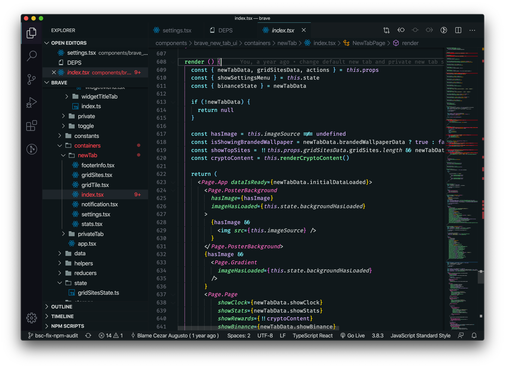

# Universo

> A calm dark theme for VS Code with a cyan, pink, green, and purple accent palette.

## Install

1. Open the **Extensions** view (`Cmd`/`Ctrl` + `Shift` + `X`).
2. Search for **Universo**.
3. Click **Install**.
4. Open the Command Palette (`Cmd`/`Ctrl` + `Shift` + `P`) → **Preferences: Color Theme** → **Universo**.

## Palette

| Role | Color |
| --- | --- |
| Background | `#12181B` |
| Foreground | `#CBCECD` |
| Cyan (keywords, tags) | `#9BF2FE` |
| Green (functions, attributes) | `#9BF2A2` |
| Purple (constants, `this`) | `#C4AAE9` |
| Pink (classes, types) | `#FF79C6` |
| Orange (parameters, warnings) | `#FCA311` |
| Yellow (strings) | `#F2F3AC` |
| Red (errors) | `#FF5555` |

## License

MIT (c) Cezar Augusto.
